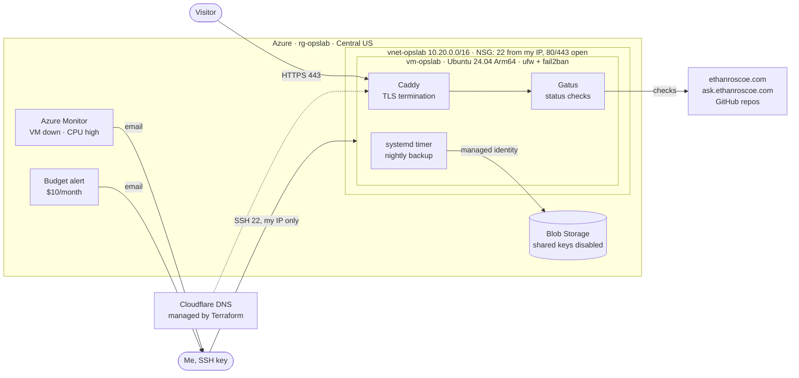

# Azure Ops Lab

An always-on Linux server in Azure, built entirely with Terraform. It has a locked-down network, no passwords or stored keys, monitoring and alerts, a budget, and tested backups, and it hosts a public status page for my portfolio and projects.

**Live:** [status.ethanroscoe.com](https://status.ethanroscoe.com)

| | |
|---|---|
| **Cloud** | Microsoft Azure (Azure for Students), Central US |
| **Server** | Ubuntu 24.04 LTS on a `Standard_B2pts_v2` Arm64 VM (free student tier) |
| **Infrastructure as code** | Terraform: 28 resources across Azure and Cloudflare DNS |
| **Services** | Gatus status page behind Caddy (automatic Let's Encrypt HTTPS), in Docker |
| **Monitoring** | Gatus checks every 5–30 min · Azure Monitor alerts by email · $10/month budget alert |
| **Backups** | Nightly to Azure Blob Storage with the VM's managed identity (no keys), kept 30 days |

## Architecture



## What each piece does and why

**Network.** One virtual network (`10.20.0.0/16`, chosen so it never overlaps my [home AD lab](https://github.com/roscoe02/ad-homelab)'s `10.10.10.0/24` if I connect them later) and a network security group that allows SSH only from my current IP and HTTP/HTTPS from anywhere. Everything else is denied by default. `ufw` on the VM enforces the same rules again (defense in depth).

**Server.** Arm64 because the free student VM size in my allowed region is Arm-based. It's cheaper per core, and everything here (Ubuntu, Docker, Caddy, Gatus, azcopy) supports it. First boot is handled by cloud-init: full patching, automatic security updates, SSH hardening (keys only, no root login, 3 attempts), fail2ban, a swap file (the VM has 1 GB of RAM), Docker, and azcopy.

**Status page.** [Gatus](https://github.com/TwiN/gatus) checks my portfolio, the skills-radar data, my AI agent, and my project repos, and every check is defined in [`stack/gatus/config.yaml`](stack/gatus/config.yaml). The AI agent check sends only a CORS preflight, so it proves the Cloudflare Worker is up without calling the Claude API (no cost per check). Caddy sits in front and gets and renews certificates automatically.

**Backups.** A systemd timer takes a consistent SQLite snapshot of the status history every night and uploads it with azcopy. The VM authenticates with its **system-assigned managed identity**, which has the *Storage Blob Data Contributor* role on that one storage account and nothing else. Shared-key access is disabled on the account, so there are no storage keys to leak. A lifecycle rule deletes backups after 30 days.

**Monitoring and cost.** Azure Monitor emails me if the VM becomes unavailable or CPU stays above 90% for 15 minutes. A subscription budget emails me at 50% and 90% of $10 and if the forecast passes 100%.

**DNS.** `status.ethanroscoe.com` and the records for my portfolio are Terraform resources too (Cloudflare provider). The Cloudflare API token can only edit DNS for this one domain and lives in the macOS Keychain, never in a file.

## How to run it

```bash
cd infra
cp example.tfvars terraform.tfvars        # subscription ID, your IP, alert email
export CLOUDFLARE_API_TOKEN=$(security find-generic-password -s cloudflare-dns-ethanroscoe -w)
terraform init && terraform apply         # builds everything (about 5 minutes)
cd .. && ./scripts/deploy.sh              # pushes the status stack and backup job, starts containers
```

| Task | Command |
|---|---|
| Changed networks, SSH times out | `./scripts/allow-my-ip.sh` (updates the NSG rule to your current IP) |
| Change a status check | Edit `stack/gatus/config.yaml`, then `./scripts/deploy.sh` |
| Run a backup now | `ssh opslab 'sudo systemctl start opslab-backup'` |
| List backups | `az storage blob list --account-name <account> -c backups --auth-mode login -o table` |
| Tear it all down | `terraform destroy` (everything is reproducible from this repo) |

## What I'd add next

- Tailscale for admin access, then close port 22 to the internet entirely.
- Connect my [Active Directory home lab](https://github.com/roscoe02/ad-homelab) to Azure: hybrid identity with Entra ID, and Azure Arc to manage the lab servers from the portal.
- Wazuh security monitoring for this VM and the lab.
- Remote Terraform state in Azure Storage with state locking.
- Port the same Terraform layout to AWS.
