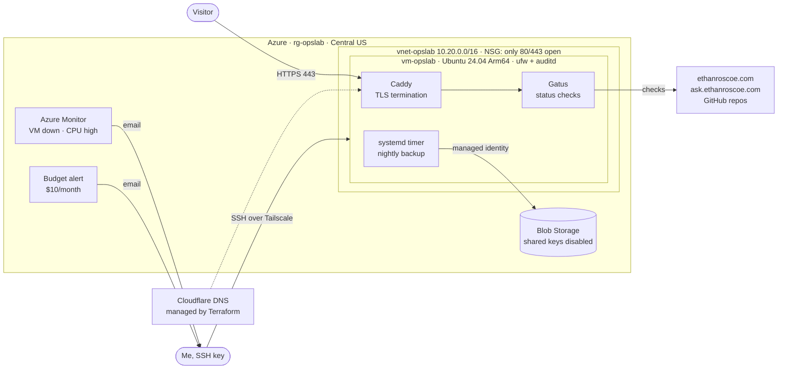

# Azure Ops Lab

An always-on Linux server in Azure, built entirely with Terraform. It has no SSH port open to the internet (admin access is over Tailscale), no passwords or stored keys, hardened containers, monitoring and alerts, a budget, and nightly backups, and it hosts a public status page for my portfolio and projects.

**Live:** [status.ethanroscoe.com](https://status.ethanroscoe.com)

| | |
|---|---|
| **Cloud** | Microsoft Azure (Azure for Students), Central US |
| **Server** | Ubuntu 24.04 LTS on a `Standard_B2pts_v2` Arm64 VM (free student tier) |
| **Infrastructure as code** | Terraform: 28 resources across Azure and Cloudflare DNS |
| **Services** | Gatus status page behind Caddy (automatic Let's Encrypt HTTPS), in Docker |
| **Admin access** | SSH over Tailscale only; port 22 is closed to the internet |
| **Hardening** | Lynis hardening index 66 → 77 after the host and container changes below |
| **Monitoring** | Gatus checks every 5–30 min · Azure Monitor alerts by email · $10/month budget alert |
| **Backups** | Nightly to Azure Blob Storage with the VM's managed identity (no keys), kept 30 days |

## Architecture



## What each piece does and why

**Network.** One virtual network (`10.20.0.0/16`, chosen so it never overlaps my [home AD lab](https://github.com/roscoe02/ad-homelab)'s `10.10.10.0/24` if I connect them later) and a network security group that allows only HTTP/HTTPS in. Everything else is denied by default, including SSH. `ufw` on the VM enforces the same rules again, plus SSH on the Tailscale interface only.

**Admin access.** I reach the VM over [Tailscale](https://tailscale.com) (WireGuard), so port 22 isn't exposed and there's nothing for internet scanners to brute-force. The one-time join key goes from the macOS Keychain to the VM over stdin ([`scripts/join-tailnet.sh`](scripts/join-tailnet.sh)), never into a file. The deploy only removes the public SSH rule from `ufw` when the deploy itself arrived over Tailscale, which proves that path works before the old one closes. If Tailscale ever breaks, `./scripts/allow-my-ip.sh` reopens SSH from my current IP until the next `terraform apply`, and `az vm run-command` works with no SSH at all.

**Server.** Arm64 because the free student VM size in my allowed region is Arm-based. It's cheaper per core, and everything here (Ubuntu, Docker, Caddy, Gatus, azcopy) supports it. First boot is handled by cloud-init: full patching, automatic security updates, a swap file (the VM has 1 GB of RAM), Docker, and azcopy. Everything after that lives in [`host/`](host/) and is applied on every deploy, so the server's config is always what's in this repo:

- **SSH:** keys only, no root, 3 attempts, no forwarding, verbose logging, login banner
- **Kernel:** sysctl hardening (no redirects, restricted kernel pointers and BPF JIT, no core dumps), unused protocols and USB storage disabled
- **Updates:** Ubuntu security updates and Tailscale install automatically, with an automatic reboot at 4 AM Central when a kernel update needs one
- **Auditing:** auditd records changes to accounts, sudo rights, SSH config, and the Docker stack

I measured it with [Lynis](https://cisofy.com/lynis/): 66 before, 77 after. I left a few suggestions alone on purpose: IP forwarding stays on because Docker needs it, and separate partitions and a GRUB password don't add much on a cloud VM with no physical console.

**Status page.** [Gatus](https://github.com/TwiN/gatus) checks my portfolio, the skills-radar data, my AI agent, and my project repos, and every check is defined in [`stack/gatus/config.yaml`](stack/gatus/config.yaml). The AI agent check sends only a CORS preflight, so it proves the Cloudflare Worker is up without calling the Claude API (no cost per check). Caddy sits in front and gets and renews certificates automatically. Both containers run with a read-only filesystem, all Linux capabilities dropped (Caddy gets back only the one for binding ports 80/443), no privilege escalation, and limits on memory, processes, and log size. Gatus runs as a regular user, not root. Only Caddy publishes ports, which matters because Docker's published ports skip `ufw`.

**Backups.** A systemd timer takes a consistent SQLite snapshot of the status history every night and uploads it with azcopy. The VM authenticates with its **system-assigned managed identity**, which has the *Storage Blob Data Contributor* role on that one storage account and nothing else. Shared-key access is disabled on the account, so there are no storage keys to leak. A lifecycle rule deletes backups after 30 days.

**Monitoring and cost.** Azure Monitor emails me if the VM becomes unavailable or CPU stays above 90% for 15 minutes. A subscription budget emails me at 50% and 90% of $10 and if the forecast passes 100%.

**DNS.** `status.ethanroscoe.com` and the records for my portfolio are Terraform resources too (Cloudflare provider). The Cloudflare API token can only edit DNS for this one domain and lives in the macOS Keychain, never in a file.

## How to run it

```bash
cd infra
cp example.tfvars terraform.tfvars        # subscription ID, alert email
export CLOUDFLARE_API_TOKEN=$(security find-generic-password -s cloudflare-dns-ethanroscoe -w)
terraform init && terraform apply         # builds everything (about 5 minutes)
cd .. && ./scripts/allow-my-ip.sh        # first build only: open SSH from your IP to bootstrap
./scripts/join-tailnet.sh                 # join the VM to your tailnet (key from Keychain)
OPSLAB_HOST=ethan@opslab ./scripts/deploy.sh   # host settings, status stack, backup job
cd infra && terraform apply               # closes public SSH again
```

| Task | Command |
|---|---|
| Deploy a change | `./scripts/deploy.sh` (over Tailscale) |
| Tailscale is down, need SSH | `./scripts/allow-my-ip.sh`, then `terraform apply` to close it again |
| Re-run the security audit | `ssh opslab 'sudo lynis audit system --quick'` |
| Change a status check | Edit `stack/gatus/config.yaml`, then `./scripts/deploy.sh` |
| Run a backup now | `ssh opslab 'sudo systemctl start opslab-backup'` |
| List backups | `az storage blob list --account-name <account> -c backups --auth-mode login -o table` |
| Tear it all down | `terraform destroy` (everything is reproducible from this repo) |

## What I'd add next

- Connect my [Active Directory home lab](https://github.com/roscoe02/ad-homelab) to Azure: hybrid identity with Entra ID, and Azure Arc to manage the lab servers from the portal.
- Wazuh security monitoring for this VM and the lab.
- Remote Terraform state in Azure Storage with state locking.
- Port the same Terraform layout to AWS.
